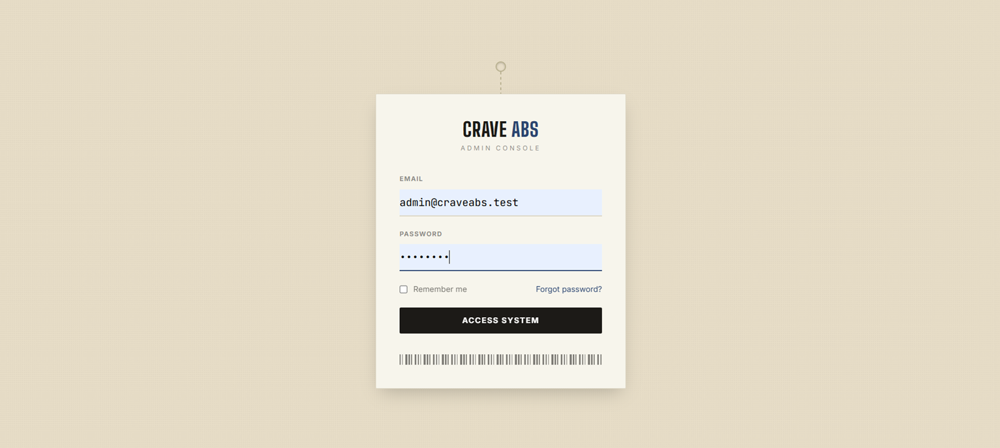
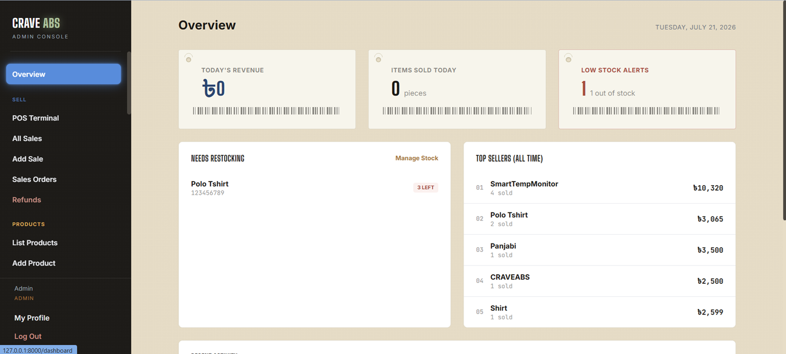
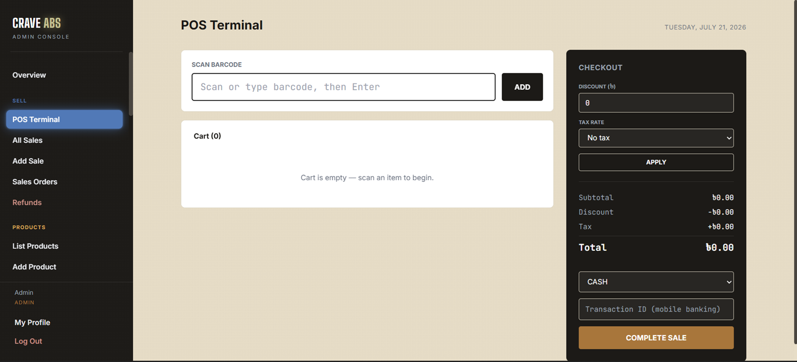
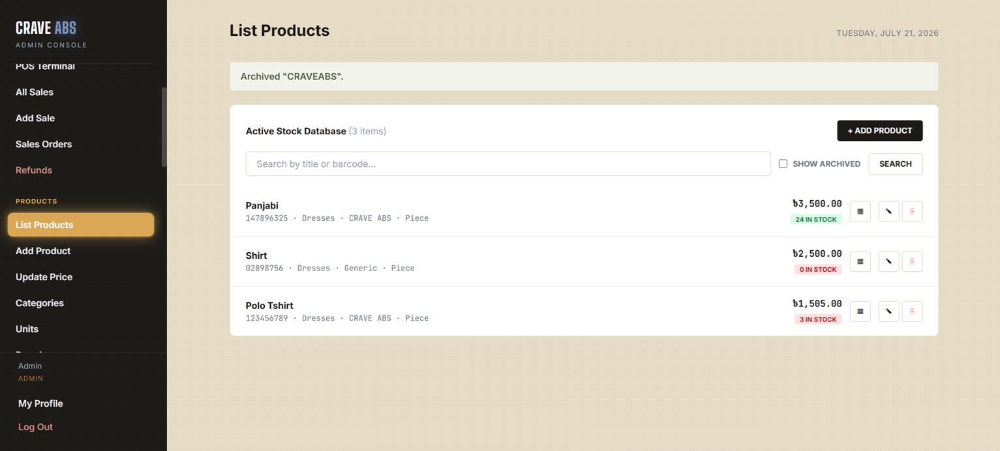
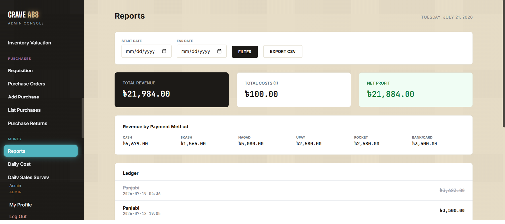
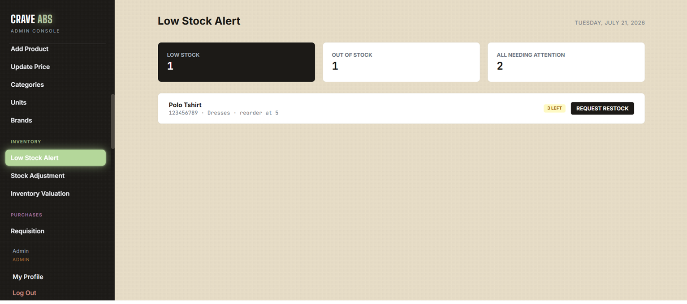

# CRAVE ABS — Clothing Brand Admin & Point-of-Sale System

**CRAVE ABS** is a full-featured web application for managing a small clothing brand's day-to-day retail operations — product catalog, inventory, point-of-sale, purchasing, staff accounts, and financial reporting — built with **Laravel 11** and **MySQL**.

It was developed as a Web Programming Lab course project, and covers the five core requirements of a small-shop inventory & sales tracker (Product Management, Inventory Management, Sales Management, Low Stock Alert, and Reports & Dashboard) with a genuine two-role permission system on top.

---

## Table of Contents

- [Overview](#overview)
- [Key Features](#key-features)
- [Tech Stack](#tech-stack)
- [User Roles](#user-roles)
- [Screenshots](#screenshots)
- [Database Design](#database-design)
- [Getting Started](#getting-started)
- [Environment Variables](#environment-variables)
- [Default Login Credentials](#default-login-credentials)
- [Project Structure](#project-structure)
- [Third-Party API Integrations](#third-party-api-integrations)
- [License](#license)

---

## Overview

CRAVE ABS replaces manual, paper-based stock and sales tracking with a single web application. Two roles use it day to day:

- **Admin** — full access to every module: product management, purchasing, refunds, financial reports, staff accounts, and settings.
- **Salesman** — can operate the POS terminal, view stock, and record sales, but is **server-side blocked** (not just UI-hidden) from registering new products, viewing purchase records, processing refunds, or accessing financial reports.

---

## Key Features

### 📦 Product Management
- Full CRUD for products, each with a unique barcode, price, quantity, and category/brand/unit tagging
- Auto-generated QR barcode labels (via QuickChart) for printing shelf tags
- Manageable Category, Unit, and Brand reference lists

### 🏷️ Inventory Management
- Stock increases via **Purchases** (receiving stock against a barcode)
- Stock decreases via **Sales** and **Purchase Returns**
- **Stock Adjustment** — manually correct stock for damage, theft, or a physical recount, with a full audit trail (before/after quantity, reason, who made the change)
- **Inventory Valuation** — total worth of everything currently in stock, broken down by category

### 🧾 Sales Management
- **POS Terminal** — barcode scan → cart → discount/tax → multi-payment checkout (Cash, bKash, Nagad, Upay, Rocket, Bank/Card), wrapped in an atomic database transaction
- **Add Sale** — search-based quick sale without a barcode scanner
- **Sales Orders** — track customer pre-orders with expected fulfillment dates
- **Refunds** — reverse a completed sale and automatically restore stock (Admin only)
- Printable receipts with an embedded QR code

### 🔔 Low Stock Alert
- Each product has its **own** reorder threshold (not one fixed number store-wide)
- Dedicated Low Stock Alert page with Low / Out-of-Stock / All filters
- One-click "Request Restock" straight into Purchase Requisition

### 📊 Reports & Dashboard
- Overview dashboard: today's revenue (in BDT **and** live-converted USD), items sold, low-stock count, top sellers, recent activity
- Reports page: revenue by date range, breakdown by payment method, net profit after logged daily costs, CSV export

### 👥 Additional Modules
- **Purchasing** — Purchase Requisition → Purchase Order (multi-line) → Add Purchase → Purchase History → Purchase Returns
- **Membership** — customer loyalty enrollment with a configurable discount percentage
- **Staff Accounts** — Admin creates/deactivates Salesman and Admin logins (no public self-registration)
- **Settings** — business info, receipt footer text, barcode prefix, tax rates

---

## Tech Stack

| Layer | Technology |
|---|---|
| Backend Framework | Laravel 11 (PHP 8.2) |
| Database | MySQL, managed via phpMyAdmin |
| ORM | Eloquent |
| Authentication | Laravel Breeze (session + cookie based, public registration disabled) |
| Templating | Blade |
| Styling | Tailwind CSS (via CDN — no build step required for styling) |
| Frontend interactivity | Vanilla JavaScript (animated sidebar navigation, live currency toggle, no JS framework) |
| External APIs | OpenWeatherMap, TimezoneDB, currencyapi.com, QuickChart (QR codes) |

---

## User Roles

| Capability | Admin | Salesman |
|---|:---:|:---:|
| POS Terminal / record sales | ✅ | ✅ |
| View product list | ✅ | ✅ |
| Add / edit / archive products | ✅ | ❌ |
| View purchases / purchase history | ✅ | ❌ |
| Process refunds | ✅ | ❌ |
| View financial reports | ✅ | ❌ |
| Manage staff accounts | ✅ | ❌ |
| Enroll members | ✅ | ✅ |

Role checks are enforced **server-side** via a custom `role:admin` route middleware — a Salesman account is blocked with an HTTP 403 even when navigating to an admin-only URL directly, not just when the sidebar link is hidden.

---

## Screenshots

> Add your own screenshots to `docs/screenshots/` and update the paths below.

| Login | Dashboard |
|---|---|
|  |  |

| POS Terminal | Products |
|---|---|
|  |  |

| Reports | Low Stock Alert |
|---|---|
|  |  |

---

## Database Design

The database consists of ~20 tables organized into seven functional modules: **Identity** (users, sessions), **Catalog** (products, categories, units, brands), **Selling** (sales, sales orders), **Buying** (requisitions, purchase orders, purchases, returns), **Inventory** (stock adjustments), **Membership**, and **Money & Settings**.

Relationships are primarily **one-to-many** (e.g., one Product has many Sales, one User logs many Stock Adjustments). Product category/brand/unit are stored as plain strings matched by name against their reference tables, rather than enforced foreign keys — a deliberate simplification for this scale of application.

> Add your ER diagram image at `docs/screenshots/erd.png` and reference it here:
> ``

---

## Getting Started

### Requirements
- PHP 8.2+
- Composer
- MySQL (e.g. via XAMPP/Laragon, with phpMyAdmin)
- Node.js (only needed for the Breeze asset build step)

### Installation

```bash
# Clone the repository
git clone https://github.com/<your-username>/<your-repo>.git
cd <your-repo>

# Install PHP dependencies
composer install

# Install Breeze's frontend assets
npm install
npm run build

# Copy the environment file
cp .env.example .env
php artisan key:generate
```

Create a MySQL database (e.g. `crave_abs`) in phpMyAdmin, then update `.env`:

```env
DB_CONNECTION=mysql
DB_HOST=127.0.0.1
DB_PORT=3306
DB_DATABASE=crave_abs
DB_USERNAME=root
DB_PASSWORD=
```

Run migrations and seed starter data:

```bash
php artisan migrate --seed
php artisan serve
```

Visit `http://127.0.0.1:8000`.

---

## Environment Variables

In addition to the standard Laravel/database variables, this project uses:

```env
# OpenWeatherMap — dashboard weather widget
OPENWEATHER_API_KEY=
OPENWEATHER_CITY="Khulna,BD"
OPENWEATHER_UNITS=metric

# TimezoneDB — dashboard local-time widget
TIMEZONEDB_API_KEY=
TIMEZONEDB_GATEWAY=https://api.timezonedb.com
TIMEZONEDB_ZONE=Asia/Dhaka

# currencyapi.com — dashboard exchange-rate widget & POS BDT/USD toggle
CURRENCYAPI_KEY=
CURRENCYAPI_BASE=USD
CURRENCYAPI_TARGETS=BDT,EUR,GBP
```

All three are optional — if a key is missing or the API is unreachable, the related widget simply doesn't render rather than breaking the page. No key is required for QR code generation (QuickChart is a free, public API).

---

## Default Login Credentials

Seeded by `php artisan migrate --seed`:

| Role | Email | Password |
|---|---|---|
| Admin | `admin@craveabs.test` | `password` |
| Salesman | `salesman@craveabs.test` | `password` |

**Change these immediately in any non-local environment.** Additional staff accounts can be created by an Admin under Staff Accounts.

---

## Project Structure

```
app/
├── Http/
│   ├── Controllers/     # One controller per feature area (Products, Purchases, Sales, Inventory, etc.)
│   ├── Middleware/       # EnsureUserHasRole (RBAC), EnsureAccountIsActive
│   └── Requests/         # Form validation classes
├── Models/                # Eloquent models — one per database table
├── Services/               # Third-party API wrappers (Weather, Timezone, Currency)
database/
├── migrations/            # Schema, in order
└── seeders/                # Starter accounts + reference data
resources/
└── views/                  # Blade templates, one folder per feature — mirrors app/Http/Controllers
routes/
├── web.php                  # All application routes, grouped by role
└── auth.php                  # Laravel Breeze authentication routes
```

---

## Third-Party API Integrations

| API | Used for |
|---|---|
| [OpenWeatherMap](https://openweathermap.org/) | Current weather on the dashboard |
| [TimezoneDB](https://timezonedb.com/) | Local time display on the dashboard |
| [currencyapi.com](https://currencyapi.com/) | Live USD/BDT/EUR/GBP exchange rates — dashboard widget and a live BDT/USD toggle in the POS checkout panel |
| [QuickChart](https://quickchart.io/) | QR code generation for product labels and sale receipts |

Each integration follows the same pattern: the API key stays server-side (`.env` → `config/services.php`), the response is cached to avoid unnecessary repeat calls, and any failure is handled gracefully so a third-party outage never breaks the page it appears on.

---

## License

This project was built for academic purposes as part of a Web Programming Lab course.

---

## Author

Built by **[TASNIM AHMED EVON]** — Web Programming Lab, [KUET].